# in.vestor.app Summary

---
[In.vester app](https://in.vester.app/) allows you to explore all new crypto stokcs and news.
The In.Vester app is provide a **user-friendly interface** that simplifies the process of ***exploring** and **observing** in cryptocurrencies and stocks.

The In.vester app offers 🚀 competitve features, such as:

- 💰 **Cryptocurrency Exploring**: The ability to explore and view trending of various cryptocurrencies, such as Bitcoin, Ethereum, and Litecoin.

- 📈 **Ticker Observing**: The ability to display real-time information about the prices and performance of various cryptocurrencies and stocks.

- 📊 **Real-time Market Data**: The [In.vester app](https://in.vester.app/) displays real-time market data for various cryptocurrencies and stocks, including price charts, market cap, trading volume, and more.

- 💡 **News & Analysis**: The [In.vester app](https://in.vester.app/) provides users with news and analysis related to cryptocurrencies and stocks, helping them stay up-to-date with the latest market trends and developments.

- 📱 **User-friendly Interface**: Many crypto stock apps have a user-friendly interface that makes it easy for users to navigate and use the app.

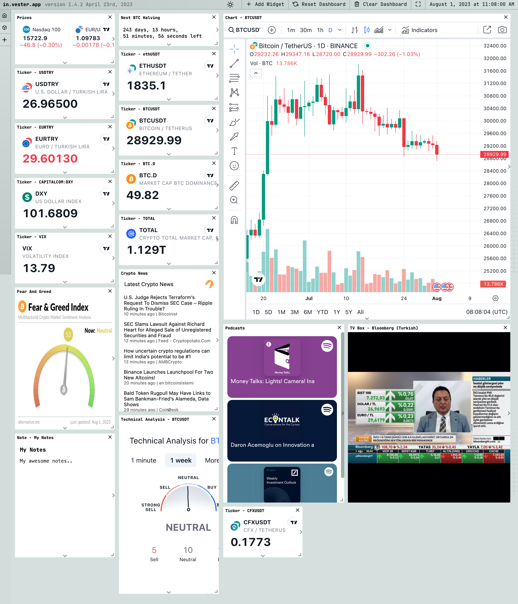

These features can help users make informed investment decisions and stay up-to-date with the latest market trends and developments.

## 💹 Dashboards

---

Dashboards in [In.vester app](https://in.vester.app/) allows you to create a customized observation and exploration of various cryptocurrencies and stocks for specific purposes.

The dashboard feature typically provides users with a visual representation of their investments observation and allows them to monitor their performance over time.

Users can customize their dashboards to display the information and data they are interested in, such as real-time market data, investment tracking, news and analysis, and other relevant data. The customization options may include selecting the type of chart or graph by adding a new **Widget** from the In.vester app, choosing the time frame, selecting the assets to display, and more.

You can **create a new custom dashboard** by clicking on the "➕" button from the left-side bar.
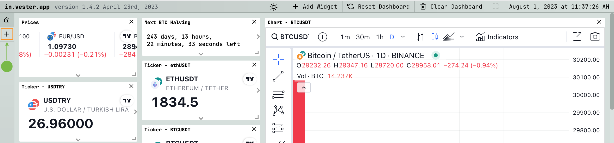

## 🧩 Widgets

---
The [In.vester app](https://in.vester.app/) app provides many widgets you can use in your dashboard by adding a new widget like a chart, graph, crypto news, price ticker, notes, and more.

**How to add a new widget in your Dashboard?**
You can add a new widget by clicking on the “**Add Widgets**” button in the app's top toolbar.

1. Click on the "**➕ Add Widgets**" button in the toolbar at the application's top to add a new widget to your dashboard.
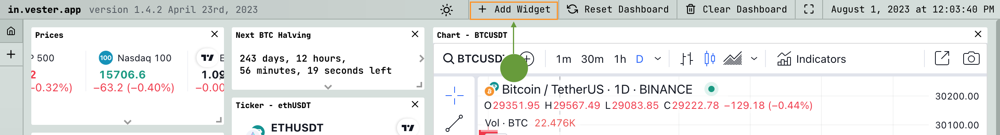
1. Select your preferred widget from the 🧩 widget list like **Chart Box, Crypto News, Price Ticker, Note**, more …
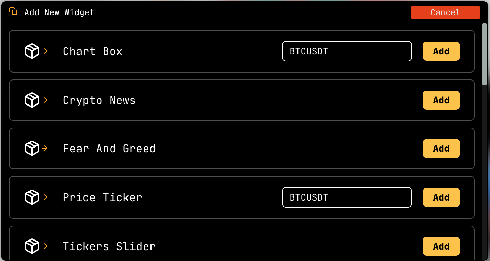

### 📊 Chart Box

The **Chart Box** widget used to display the visual representation of the 💰 **price of cryptocurrencies** over ⏰ **time**.

This feature allows you to easily track the price movements of their favorite cryptocurrencies and make well-informed decisions. With Chart Box, you can select a **specific time frame** to **view and zoom in or out to see price trends more clearly**. This means you can **analyze** the price movements of cryptocurrencies from a macro perspective or a micro perspective, depending on their preferences.

**How to add a Chart Box Widget from In.vestor app?**

1. Click on the "**➕ Add Widgets**" button in the toolbar at the application's top to view all widgets.

2. Select "Chart Box" widget from the widget list.

#### 🕒 Time interval

The main functionality of time interval in the Chart Box is to allow you to select a specific **🕰️ time frame** (Minutes - Hours - Days - Ranges) to view and analyze the price movements of cryptocurrencies.

**How to select Time interval in Chart-box widget?**

1. Select Chart-Box widget.
2. Select the time interval from the favorite.
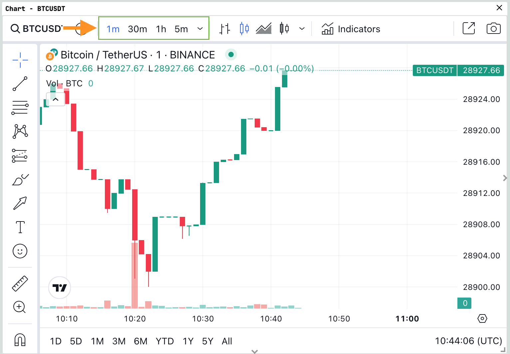
3. You can add a custom time-frame from the drop-down.

4. You can add the time-frame to your favorite list.
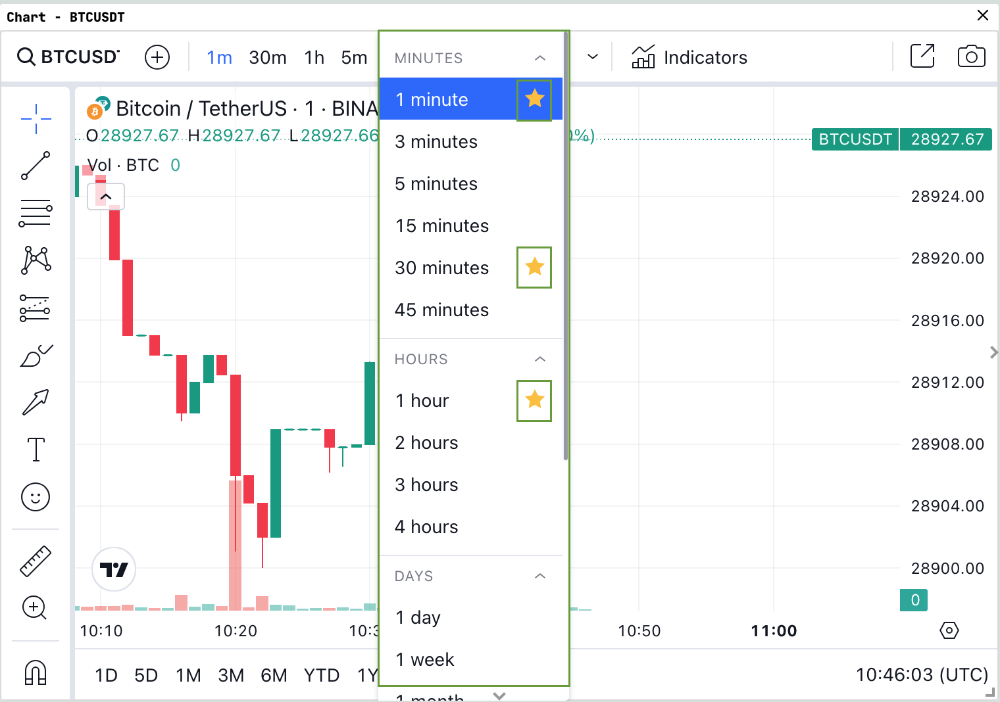

#### 📈 Bar Style

The main functionalities for the bar style in a chart box include:

- **Cross**: It is a tool used to pinpoint specific price levels on a chart.
- **Trend Line**: It is a line drawn between two or more price points on a chart, used to help identify the direction of a trend.
- **Fib Retracement**: A Fibonacci retracement is a tool used to identify potential support and resistance levels on a chart.
- **Long Position**: It is a trading position that benefits when the price of an asset increases.
- **Brush**: It is a tool used to highlight a specific area of a chart. An arrow maker is a tool used to draw arrows on a chart to indicate specific points of interest.
- **Text**: It can be added to a chart to provide additional information.
- **Icons**: It can be added to a chart to indicate specific events or conditions.
- **Measure tool**: It is used to calculate the distance between two points on a chart.
- **Zoom in and out**: It is a tools allow the user to adjust the scale of a chart to focus on specific timeframes or price ranges.

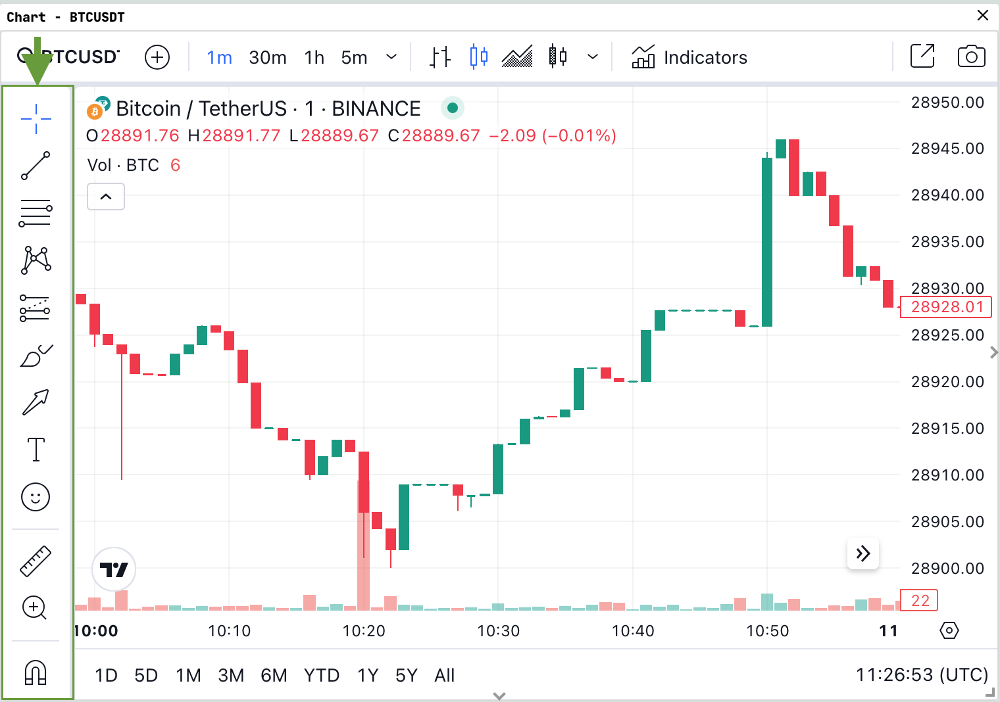

#### Trend Line

It is a line drawn between two or more price points on a chart, used to help identify the direction of a trend.

#### Fib Retracement

A Fibonacci retracement is a tool used to identify potential support and resistance levels on a chart.

#### XABCD Pattern

The XABCD pattern is a popular trading pattern that is used to identify potential reversal points in a market. The pattern consists of a series of price swings that form specific geometric shapes.
The XABCD pattern is named after the **four points** that make up the pattern: X, A, B, and C.

- The **X point** is the starting point of the pattern and is typically the point where a trend begins.
- The **A point** is the first swing high or swing low in the pattern and is used to form the initial trend line.
- The **B point** is the retracement of the initial trend and is typically between 38.2% and 78.6% of the initial trend.
- The **C point** is the point where the price begins to move back in the direction of the initial trend.
- Finally, the **D point** is the point where the price completes the pattern and begins to move in the opposite direction. The XABCD pattern is a powerful tool for identifying potential reversal points in a market, and is frequently used by traders to make trading decisions.

### 🆕 Crypto News

Crypto New is a widget allows you to check the last crypto news and tips.
You can view the last news related to cryptocurrencies, which are digital or virtual currencies that use cryptography for security. This can include updates on the price of cryptocurrencies, new blockchain technologies, regulatory developments, and other news related to the crypto industry.

**How to add a Crypto News Widget from In.vestor app?**

1. Click on the "**➕ Add Widgets**" button in the toolbar at the application's top to view all widgets.

1. Select "Crypto News" widget from the widget list.
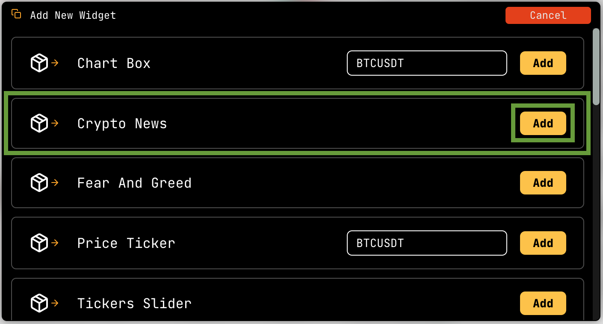

### Fear and Greed

Fear and greed are two emotions that often drive financial markets and investments.

- **Fear** can cause investors to panic and sell assets, which can cause a decline in prices.
- **Greed**, on the other hand, can cause investors to take on more risk in search of higher returns.

**How to add a Fear and Greed Widget from In.vestor app?**

1. Click on the "**➕ Add Widgets**" button in the toolbar at the application's top to view all widgets.

1. Select "Fear And Greed" widget from the widget list.
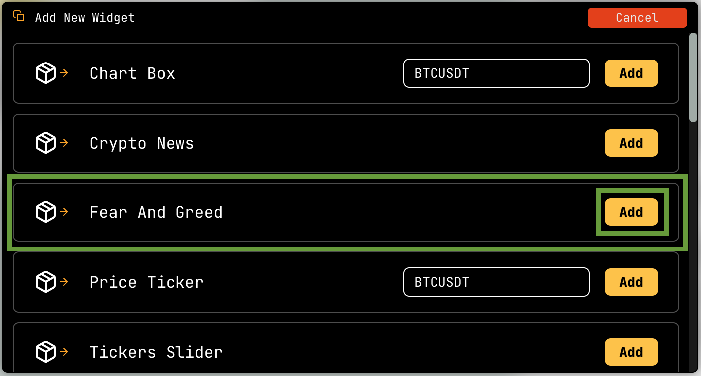
1. You can view Fear and Greed in your Dashbaord.
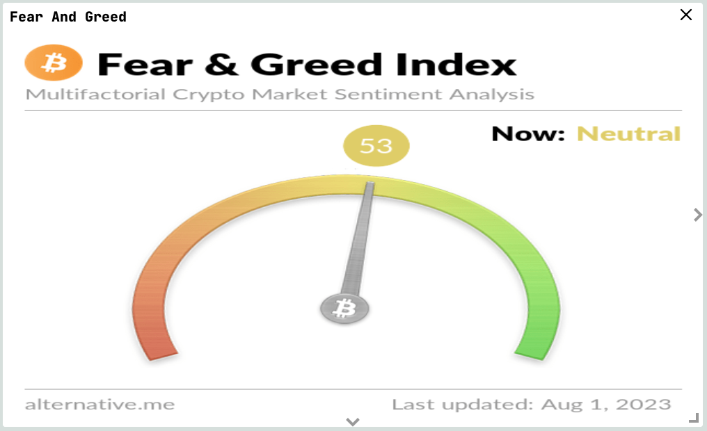

### Price Ticker

Price Ticker is a widget that constantly displays the current prices of financial assets such as stocks, bonds, and commodities. It provides real-time information on the prices of these assets, allowing users to stay informed and make informed investment decisions.

**How to add a Price Ticker Widget from In.vestor app?**

1. Click on the "**➕ Add Widgets**" button in the toolbar at the application's top to view all widgets.

1. Select "**Time Ticker**" widget from the widget list.
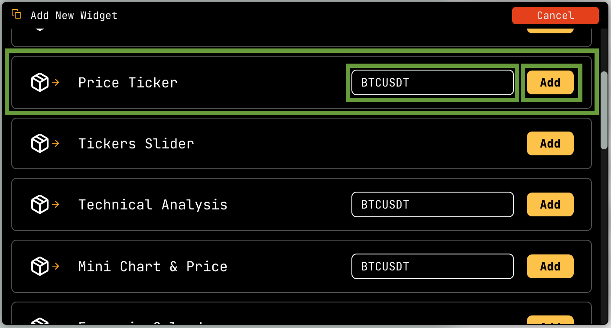
1. You can view Price Ticker in your Dashbaord.
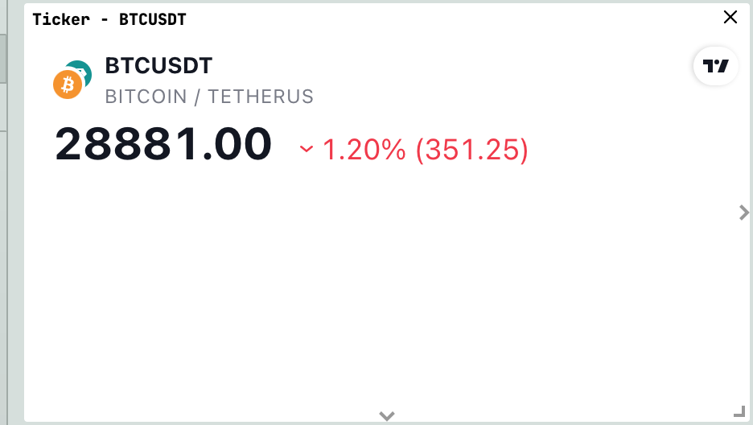

### Tickers Sliders

A ticker slider is a user interface element that displays a **series of ticker symbols with corresponding price information**.
The slider allows the user to adjust the **time range** of the information displayed, such as the past hour, day, week, or month. As the slider moves, the ticker symbols and prices change to reflect the selected time range. This functionality is commonly used in financial applications to display real-time stock market data.

**How to add a Tickers Slider Widget from In.vestor app?**

1. Click on the "**➕ Add Widgets**" button in the toolbar at the application's top to view all widgets.

1. Select "**Tickers Slider**" widget from the widget list.
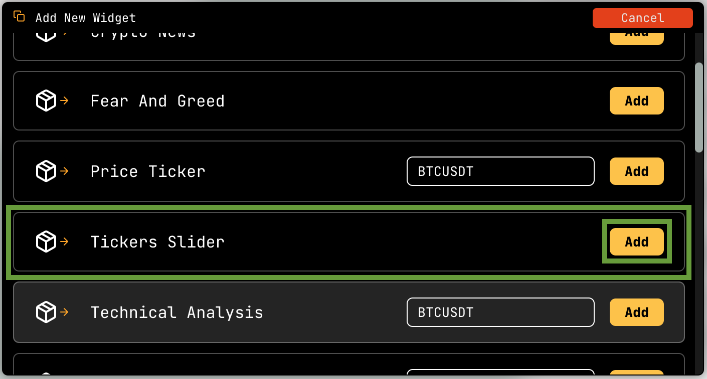
1. You can view Tickers Slider in your Dashbaord.
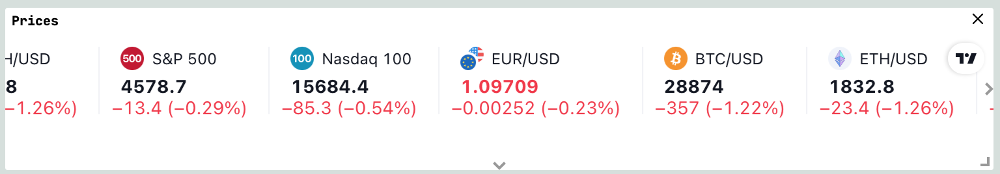

### Technical Analysis

Technical analysis for cryptocurrencies is a method of evaluating market data, such as price and trading volume, to identify trends and make predictions about future price movements. It involves using charts, trend lines, and various technical indicators to analyze historical market data and identify patterns that can be used to predict future trends.

**How to add a Technical Analysis Widget from In.vestor app?**

1. Click on the "**➕ Add Widgets**" button in the toolbar at the application's top to view all widgets.

1. Select "**Technical Analysis**" widget from the widget list.
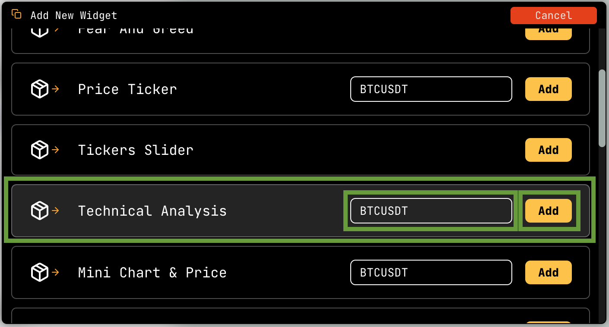
1. You can view Technical Analysis in your Dashbaord.
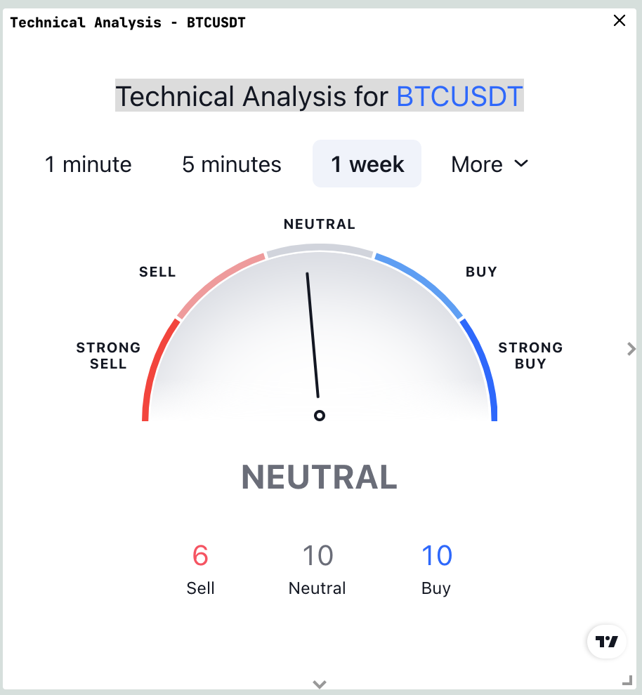

### Mini Chart & Price

A mini chart is a small graphical representation of the price change of a cryptocurrency over a certain period of time. It is often used to quickly visualize the price trend of a particular cryptocurrency.

**How to add a Mini Chart & Price Widget from In.vestor app?**

1. Click on the "**➕ Add Widgets**" button in the toolbar at the application's top to view all widgets.

1. Select "**Mini Chart & Price**" widget from the widget list.
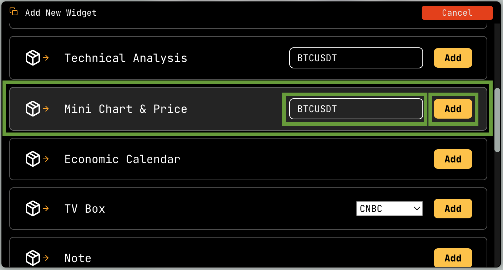
1. You can view Mini Chart & Price in your Dashbaord.
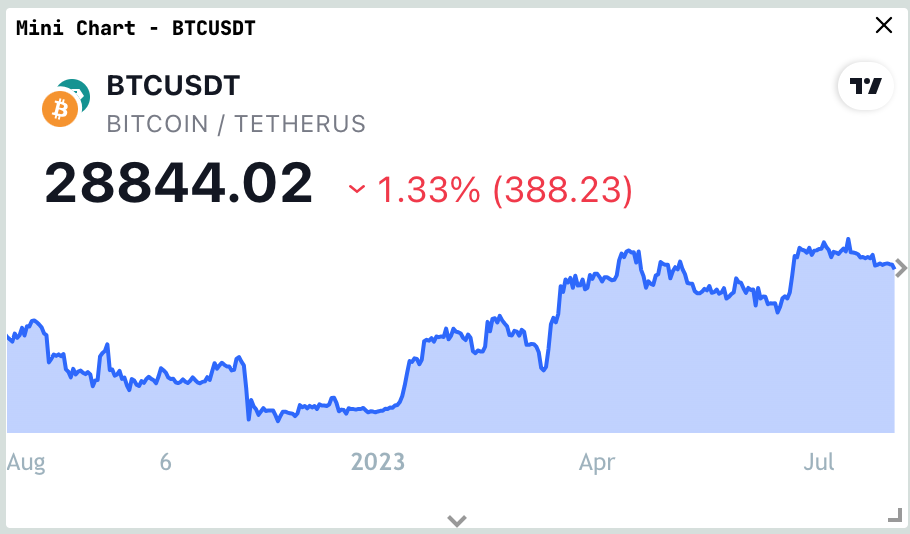

### Economic Calendar

An economic calendar in the context of cryptocurrency is a tool used to keep track of upcoming economic events that are likely to impact the market. These events can include government policy announcements, industry developments, and other important news.

**How to add an Economic Calendar Widget from In.vestor app?**

1. Click on the "**➕ Add Widgets**" button in the toolbar at the application's top to view all widgets.

1. Select "**Economic Calendar**" widget from the widget list.
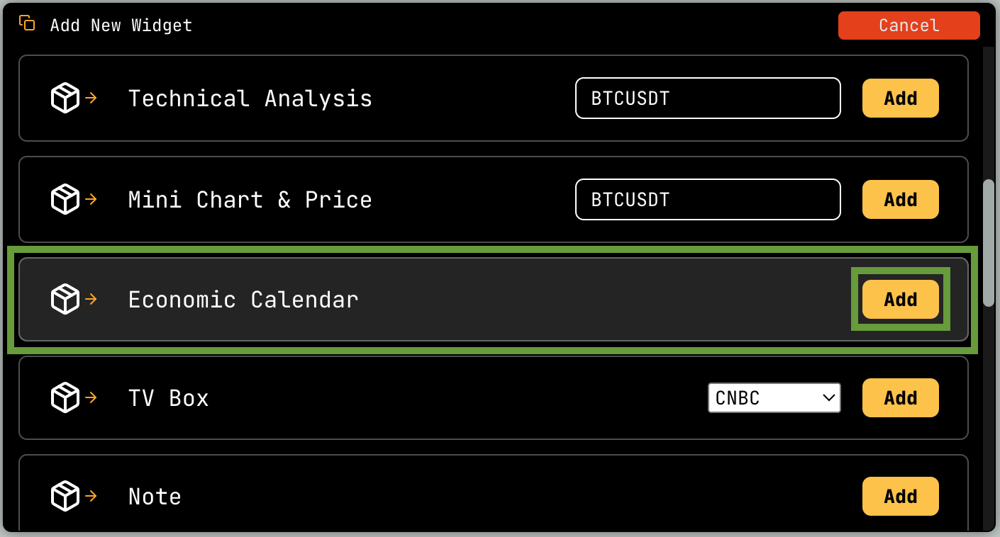
1. You can view the Economic Calendar in your Dashbaord.
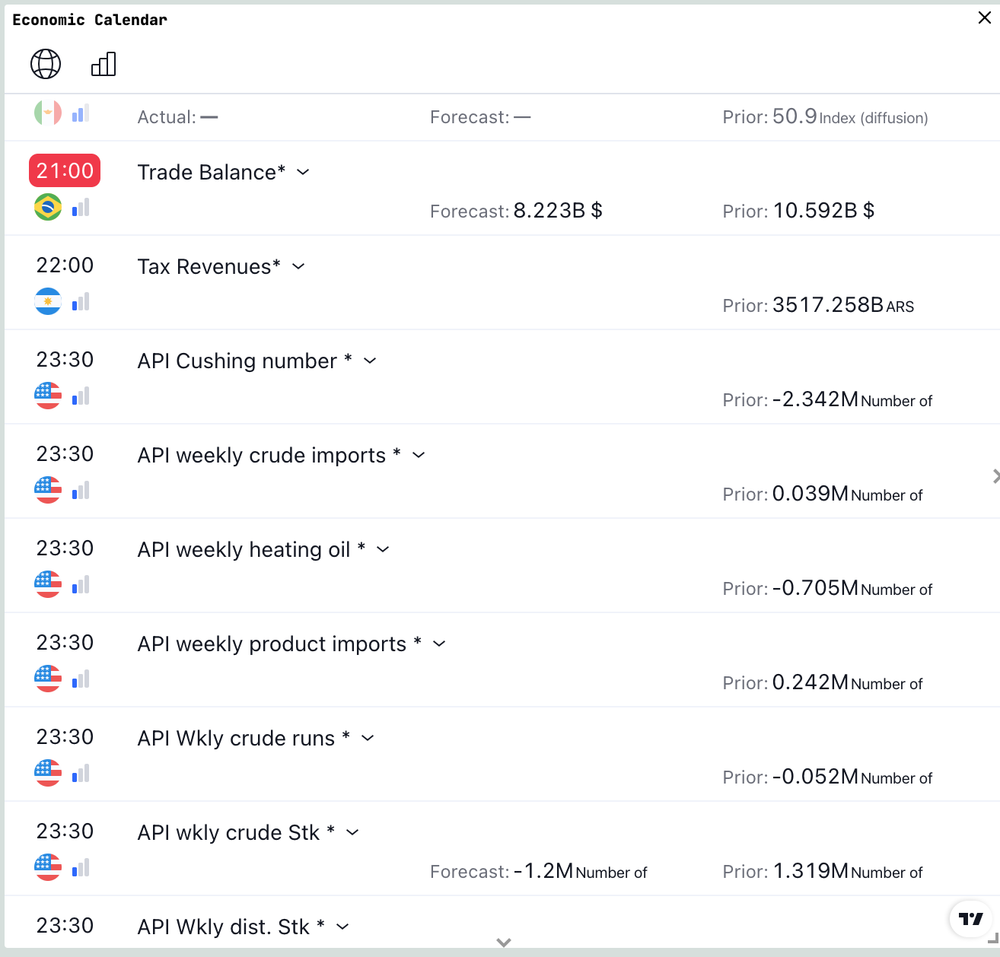

### TV Box

This features allows you to view the live TV channels like **CNBC** or **Bloomberg**.

**How to add an Economic Calendar Widget from In.vestor app?**

1. Click on the "**➕ Add Widgets**" button in the toolbar at the application's top to view all widgets.

1. Select "**TV Box**" widget from the widget list.

1. You can view the TV Box widget in your Dashbaord.
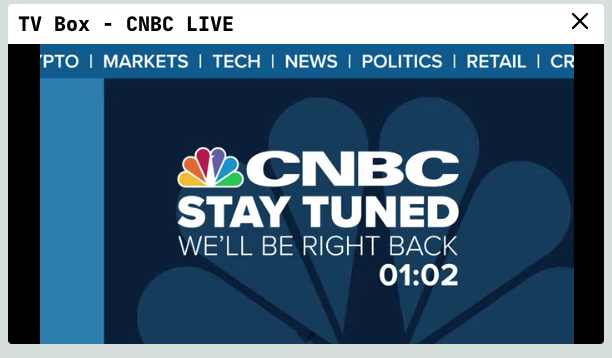

### Note

This feature allows you to add your notes while observing the app to store an important notes. You can add the **Title** of the note and write youe **Notes** after adding the note widget.

**How to add an Note Widget from In.vestor app?**

1. Click on the "**➕ Add Widgets**" button in the toolbar at the application's top to view all widgets.

1. Select "**Note**" widget from the widget list.
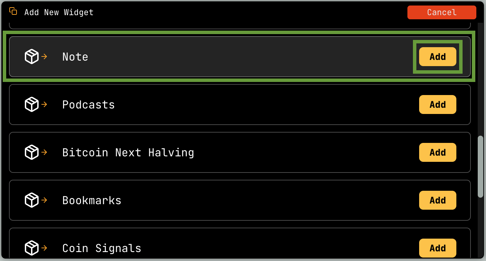
1. You can view the Note widget in your Dashbaord.
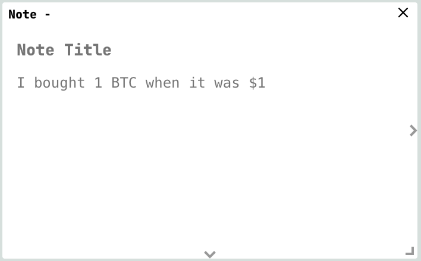

### Podcasts

This feature allows you to listen to the latest cryptocurrency podcasts and check the latest news.

**How to add an Podcasts Widget from In.vestor app?**

1. Click on the "**➕ Add Widgets**" button in the toolbar at the application's top to view all widgets.

1. Select "**Podcasts**" widget from the widget list.
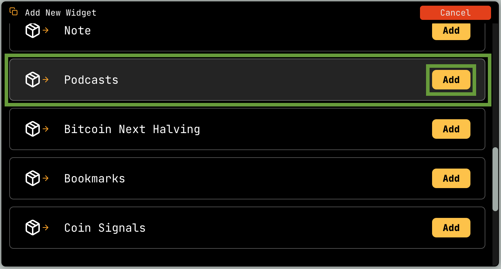
1. You can view the Podcasts widget in your Dashbaord.
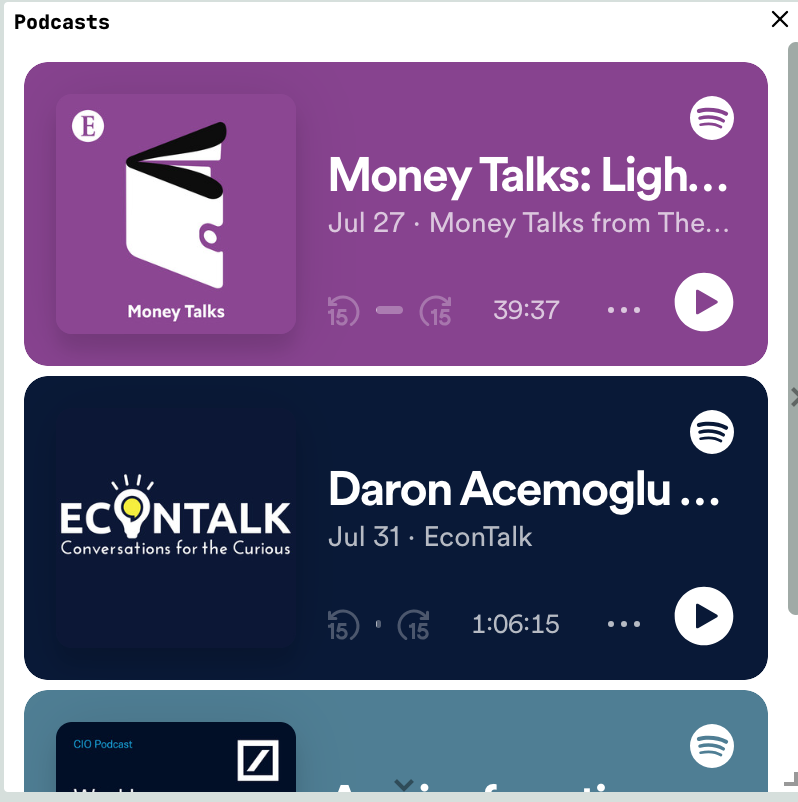

### Bitcoin Next Halving

Bitcoin halving is a process that occurs approximately every **four years**, in which the amount of new Bitcoin created and earned by miners for mining a block is reduced by half. This is a built-in feature of Bitcoin's protocol that ensures its scarcity and controls its inflation rate.

**How to add an Bitcoin Next Halving Widget from In.vestor app?**

1. Click on the "**➕ Add Widgets**" button in the toolbar at the application's top to view all widgets.

1. Select "**Bitcoin Next Halving**" widget from the widget list.
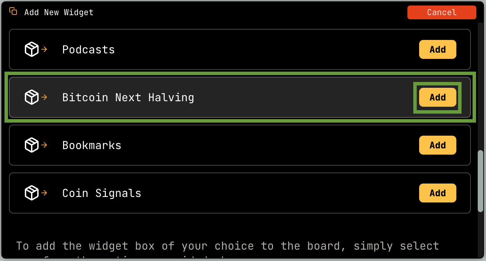
1. You can view the Bitcoin Next Halving widget in your Dashbaord.
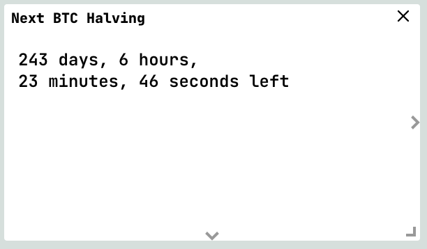

### Bookmarks

This feature allows you to create a custom bookmarks in your dashboard by creating a new bookmark by adding the **Title** and **URL** of the bookmark.

**How to add an Bookmarks Widget from In.vestor app?**

1. Click on the "**➕ Add Widgets**" button in the toolbar at the application's top to view all widgets.

1. Select "**Bookmarks**" widget from the widget list.
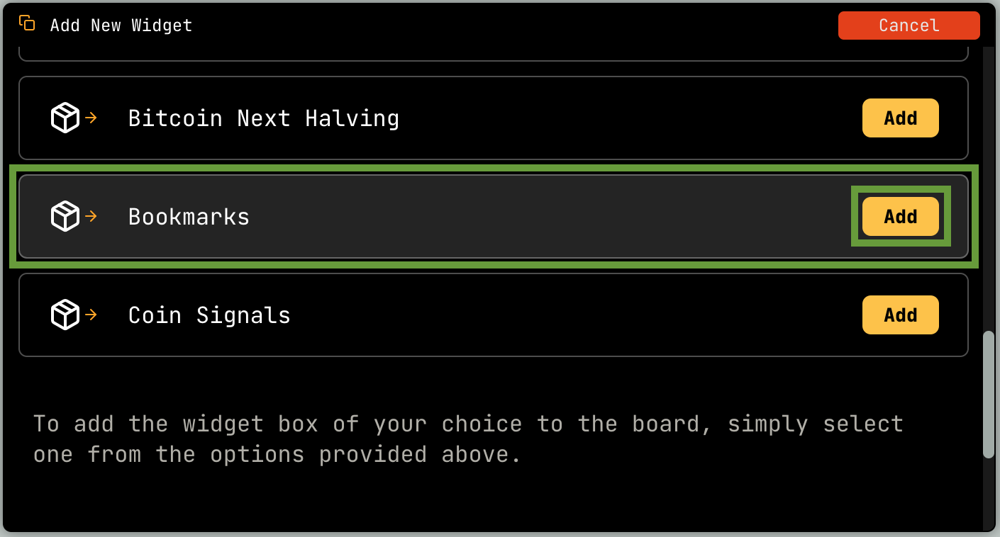
1. You can view the Bookmarks widget in your Dashbaord.
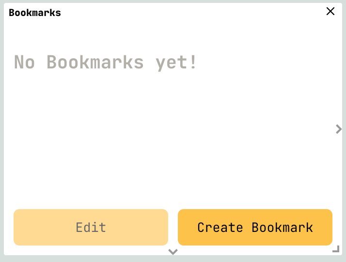
1. You can create a new Bookmark by clicking on "**Create Bookmark**" `Button` and adding the title and Link, then save bookmark.
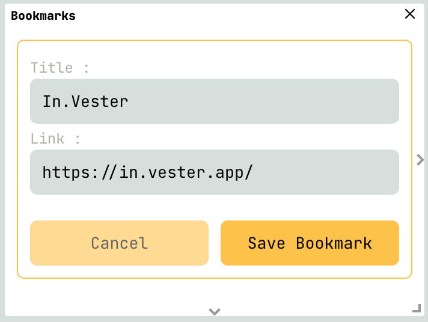

### Coin Signals

Coin signals refer to the phenomenon of certain cryptocurrency traders or investors signaling their future intentions with regards to a particular coin. This can be done through various means, such as posting on social media, making large trades, or signaling through technical analysis charts. The purpose of these signals is often to try to influence the market and create a certain outcome, such as a rise or fall in the price of the coin. It is important to note that not all coin signals are genuine or reliable, and investors should do their own research and analysis before making any decisions based on these signals.

**How to add an Coin Signals Widget from In.vestor app?**

1. Click on the "**➕ Add Widgets**" button in the toolbar at the application's top to view all widgets.

1. Select "**Coin Signals**" widget from the widget list.
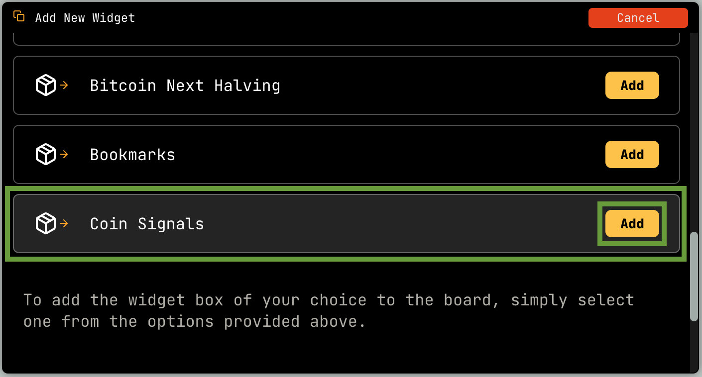

## App Configuration

This feature allows you to configure the app in the following ways:

- **Clear Dashboard**: Allows you to clear all widgets and their contents. This will reset the dashboard, and you will lose your notes and other information.
- **Reset Dashboard***: Allows you to reset the dashboard to its default settings. This will also clear all widgets and their contents, causing you to lose your notes and other information.
- **Full Screen**: Allows you to view the app in full screen mode in your browser.

### Light / Dark Mode

This functionality allows you to switch between dark and light mode in the app.
